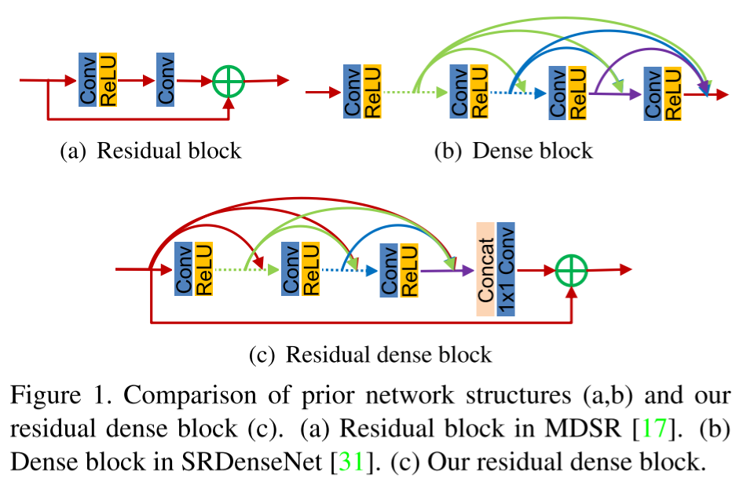

# Residual Dense Network for Image Super-Resolution

- https://arxiv.org/abs/1802.08797
- CVPR 2018
- additional resources
  - https://github.com/yulunzhang/RDN
  - https://github.com/sanghyun-son/EDSR-PyTorch/blob/8dba5581a7502b92de9641eb431130d6c8ca5d7f/src/model/rdn.py

## 1 Introduction

## 2 Related Work

## 3 Residual dense network for image SR

### 3.1 Network structure

- composition of RDN
  - shallow feature extraction network (SFENet)
  - residual dense blocks (RDBs)
  - dense feature fusion (DFF)
  - upsampling net (UPNet)
    - use upscaler from ESPCN

### 3.2 Residual dense block

##### Contiguous memory

- for c-th conv layer
  - the number of input feature maps
    - $G_0 + (c - 1) \times G$

##### Local feature fusion

- by a 1x1 convolution layer

##### Local residual learning

### 3.3 Dense feature fusion

##### Global feature fusion

##### Global residual learning

### 3.4 Implementation details

- use CNN layers with 3x3 kernels if not specified

## 4 Discussions

##### Difference to DenseNet

##### Difference to SRDenseNet

##### Difference to MemNet

## 5 Experimental results

### 5.1 Settings

##### Datasets and metrics

##### Degradation models

##### Training settings

### 5.2 Study of D,C, and G.

- D
  - the number of RDBs
  - seems that the more the better
- C
  - the number of Conv layers
  - seems that the more the better
- G
  - the growth rate
  - the number of output feature maps by a Conv layer within a RDB
  - seems that the higher the better

### 5.3 Ablation investigation

### 5.4 Results with BI degradation model

- degradation model: BI
  - prepare dataset by down sampling it with the bicubic method (2x, 3x, 4x)
- RDN+
  - for the case when the self ensemble method is used

### 5.5 Results with BD and DN degradation models

- degradation model: BD
  - prepare dataset by blurring with 7x7 Gaussian kernel and then down sampling with the bicubic method
- degradation model: DN
  - prepare dataset by adding Gaussian noise into LR images

### 5.6 Super-resolving real-world images

- degradation model is unknown

## References

