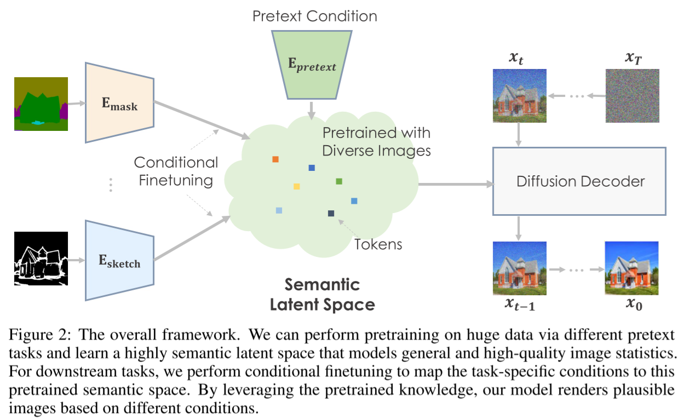

# Pretraining is All You Need for Image-to-Image Translation

- https://arxiv.org/abs/2205.12952
- finetune GLIDE
  - by replacing the text condition encoder with an image encoder
  - probably for image-to-image tasks

##### GLIDE

- base diffusion model
  - resolution
    - 64x64
  - conditioned on text
  - model configurations
    - parameters
      - (small) 300M
      - (big) 3.5B
- upsampler: diffusion upsampling model
  - resolution
    - 64x64 to 256x256
  - conditioned on text
  - model configurations
    - parameters
      - (big) 1.5B
- data
  - people are filtered out for the 300M model to be released

##### Two-stage training

- first stage
  - train encoder
  - freeze decoder
- second stage
  - train both encoder and decoder

##### Adversarial diffusion upsampler ⭐

- apply data augmentation
  - the real-world BSR degradation
- finetune upsampler
  - predict $\hat{\boldsymbol{x}} _0^t$
  - and minimize
    - L2 loss
      - the same as the usual diffusion model loss 
    - $\mathcal{L} _\text{perc} = \mathbb{E} _{t, \boldsymbol{x} _0, \boldsymbol{\epsilon}} \Vert \psi _m (\hat{\boldsymbol{x}} _0^t - \boldsymbol{x} _0)\Vert$
      - perceptual loss
      - $\psi _m (\cdot)$
        - multi level features from a pretrained VGG network
    - $\mathcal{L} _\text{adv} = \mathbb{E} _{t, \boldsymbol{x} _0, \boldsymbol{\epsilon}} \left[ \log D _\theta (\hat{\boldsymbol{x}}^t) \right] + \mathbb{E} _{\boldsymbol{x} _0} \left[ \log(1 - D _\theta(\boldsymbol{x} _0)) \right]$
      - adversarial loss
      - $D_\theta$
        - the adversarial discriminator that tries to maximize $\mathcal{L} _\text{adv}$

##### Normalized classifier-free guidance (CFG) ⭐

- correct the distribution shift with respect to $w$
  - especially when $w$ is great
  - assuming $\boldsymbol{\epsilon} _\theta (\boldsymbol{x}_t | \boldsymbol{y})$ and $\boldsymbol{\epsilon} _\theta (\boldsymbol{x}_t | \boldsymbol{\empty})$ are independent variables
- $\hat{\mu} = \mu + w(\mu - \mu _\empty)$
- $\hat{\sigma}^2 = (1 + w)^2 \sigma^2 + w^2 \sigma _\empty ^2$

