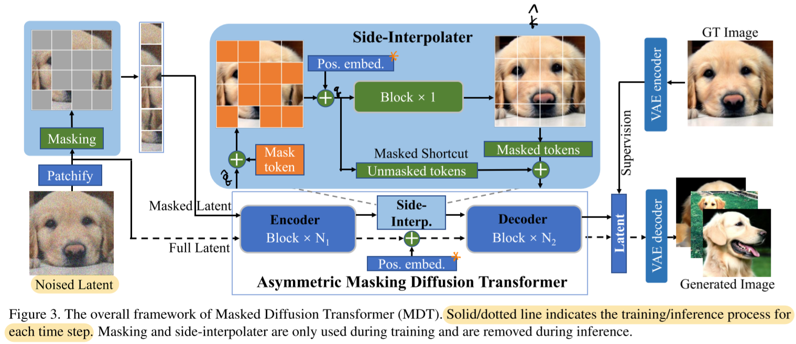

# Masked Diffusion Transformer is a Strong Image Synthesizer

- https://arxiv.org/abs/2303.14389v1
- SOTA for the ImageNet 256 image generation task

## 1 Introduction

- MDT
  - contains
    - VAE encoder
    - VAE decoder
    - `AMDT`
      - contains
        - `Patchify` for inference
        - encoder blocks
          - 26 blocks for MDT-XL/2
        - side-interpolater
          - contains
            - learnable positional embedding
            - a prediction block
        - decoder blocks
          - 2 blocks for MDT-XL/2
    - `Patchify` for training
    - a masking layer
- further take-aways ⭐
  - a learnable global position embedding
  - a relative positional embedding as a bias for the self attention layers
  - classifier free guidance with a power-cosine weight scaling
    - refer to appendix D for more details

- benefits
  - faster convergence when training the model

- misc.
  - during training both the full and masked latent embeddings are fed into the diffusion model
    - so we're not able to save memory

## 2 Related work

### 2.1 Diffusion probabilistic models

### 2.2 Network for diffusion models

### 2.3 Mask modeling

## 3 Revisitation of diffusion probabilistic model

## 4 Masked diffusion transformer

### 4.1 Overview

### 4.2 Latent masking

##### Latent diffusion model

##### Latent masking operation

### 4.3 Asymmetric masking diffusion transformer

##### Position-aware encoder and decoder

##### Side-interpolater

### 4.4 Training

## 5 Experiments

### 5.1 Implementation

##### Model architecture

##### Training details

##### Evaluation

### 5.2 Comparison results

##### Performance comparison

##### Convergence speed

### 5.3 Ablation

##### Masking ratio

- 0.3 was the best

##### Asymmetric vs. Symmetric architecture in masking

- asymmetric architecture was better

##### Full and masked latent tokens

- using both are better

##### Loss on all tokens

- yes, it's better to calculate loss on all tokens 

##### Effect of side-interpolater

- good to have

##### Masked shortcut in side-interpolater

- good to have

##### Side-interpolater position

- before the last two blocks was the best

##### Block number in side-interpolater

- using a single block is the best

##### Positional-aware enhancement

- good to learn the global positional embedding
- good to have the relative positional embedding

## 6 Conclusion

## References

[6] Muse

[7] MaskGIT

[16] MAE

[31] DiT

## A Model details

## B Comparison of VAE decoders

## C Inpainting with MDT

## D Improved classifier-free guidance

$$
w_t =
{
1 - \cos \pi \left( {t \over t_\text{max}}\right)^s
\over
2
}
w
$$

- inspired by Muse where a linear increasing schedule was used

- hyper parameters chosen:

  - $s = 4$

  - $w = 3.8$

## E Visualization
