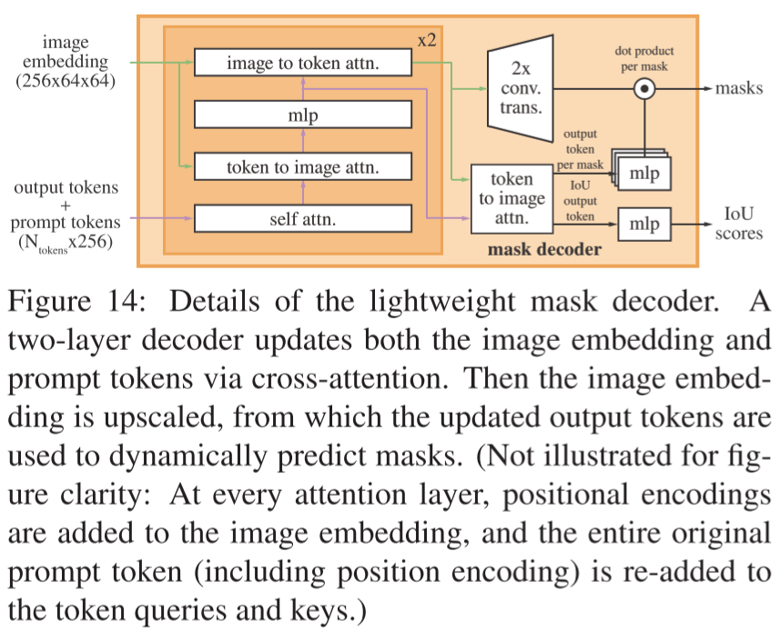

# Segment Anything

- https://arxiv.org/abs/2304.02643
- Meta AI Research, FAIR
- Tried to train a foundation model for any segmentation tasks
- SAM
    - model
- SA-1B
    - dataset

## 1 Introduction

## 2 Segment anything task

- inspired by GPT3
    - pretraining by next token generation
    - to solve diverse downstream tasks via prompt engineering
        - https://en.wikipedia.org/wiki/Prompt_engineering
- similar to interactive segmentation
- pretrain the model
    - given prompts
        - points/boxes/text/segmentation
    - predicts the ground truth
- zero-shot transfer
    - e.g.
        - any cat bounding box detector would be used for segmentation

## 3 Segment anything model

- Image encoder
    - with a pretrained ViT adapted to high resolution inputs
    - encodes 1024x1024x3 into 64x64x256
- Prompt encoder
    - (sparse)
        - points
            - encoded into 256x1 token
            - positional encoding + foreground embedding
            - positional encoding + background embedding
        - boxes
            - encoded into two 256x1 tokens
            - left top positional encoding + left top embedding
            - right bottom positional encoding + right bottom embedding
        - text
            - encoded via CLIP
    - (dense)
        - 256x256x1 mask is encoded into 64x64x256 via a few conv layers
            - element-wisely added into the image embedding
- Mask decoder

## 4 Segment anything data engine

- Assisted-manual stage
    - SAM
        - a browser based interactive segmentation
        - trained on public segmentation datasets
        - encoder network
            - ViT-B (at first)
            - ViT-H (later)
    - annotators masked prominent objects first
    - go to the next image once a mask took over 30 seconds to annotate
    - retrain SAM 6 times
        - using only the newly annotated masks
    - annotation time per mask decreased
- Semi-automatic stage
    - prominent objects were masked automatically
    - annotators masked any unannotated objects first
- Fully automatic stage
    - already collected enough masks to improve the model
    - developed the ambiguity aware model
    - IoU prediction module
        - select confidence segments by a threshold
    - non-maximum suppression (NMS)
        - to filter duplicates

## 5 Segment anything dataset

- SA-1B dataset
    - 11M images
        - resized images for shortest side to be 1500 px
        - faces and vehicle license plates have been blurred
    - more than 1B masks
        - all masks are automatically generated
        - compared to manual masks 94% of pairs have greater than 90% IoU
        - the center of masks are more spread out than the other major segmentation datasets

## 6 Segment anything RAI analysis

## 7 Zero-shot transfer experiments

## 8 Discussion

**Foundation models**

- Foundation models are trained on broad data at scale and are adaptable to a wide range of downstream tasks.
- Limitations
    - quality would not better than dedicated interactive segmentation methods
    - text-to-mask is not robust yet

## References

- [10] GPT3
- [47] MAE ⭐
- [82] CLIP
- [83] DALL·E
